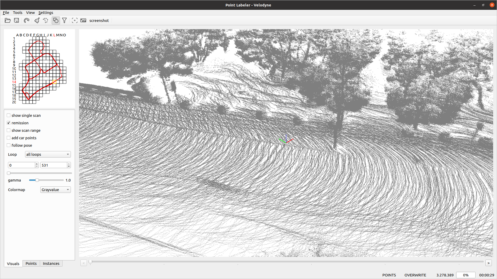

# ERASOR2 (RSS'22) + DynaKAIST (Update 23.01.08)

Official page of *"ERASOR2"*


## Test Env.
The code is tested successfully at
* Linux 20.04 LTS
* ROS Noetic

### 수정사항
3rdparty 폴더는 무시해주세요...


### HeLiPR 데이터 폴더 형식
```
${abs_data_dir} ex) /media/se0yeon00/SY_Other/HeliPR/KAIST05
│   ├── Calibration
│   ├── Inertial_data
│   ├── LiDAR
│       ├── Aeva
│       ├── Avia
│       ├── Ouster
│       └── Velodyne
│   └── LiDAR_GT
│       ├── Aeva_gt.txt 
│       ├── Avia_gt.txt 
│       ├── Ouster_gt.txt 
│       ├── Velodyne_gt.txt 
        ...    

```

### 1. inspva.csv 파일로 부터 INS trajectory 구하기
`inspva.csv` 파일로 부터 INS trajectory 를 계산해, txt 파일로 만들어줍니다.
이는 `timestamp.bin` 으로 명명되어 있는 각각의 라이다 스캔 데이터를 deskewing 할 때 사용됩니다.
erasor2 의 `config/HeLiPR_kitti.yaml` 을 본인의 폴더 경로와 같이 수정해주세요.

```
dataprocessor:
    dataset_root: "/media/se0yeon00/SY_Other/HeliPR/KAIST05/"
    process_lidar_list: ["Aeva", "Avia", "Ouster", "Velodyne"]
    save_ins_to_LiDAR_root: "/media/se0yeon00/SY_Other/HeliPR/KAIST05/ins_to_lidar"
dataloader:
    abs_data_dir: "/media/se0yeon00/SY_Other/HeliPR/KAIST05/deskewed_LiDAR"
```

여기서 `/dataprocessor/dataset_root` 는 HELiPR KAIST05 가 들어있는 path 를,
`/dataprocessor/save_ins_to_LiDAR_root` 는 INS trajectory 에 대한 txt 파일이 저장되는 곳입니다.
그리고 `/dataloader/abs_data_dir` 은, 추후에 디스큐잉된 라이다가 semanticKitti 포맷으로 저장될 경로입니다.

그 다음, 아래와 같이 시행해주세요.
```
catkin build erasor2
roslaunch erasor2 transformINStoLiDAR.launch
```

이렇게 하면, `/dataprocessor/save_ins_to_LiDAR_root`에 `/<sensorType>_trajectory.txt` 와 같은 파일이 생성됩니다.


### 2. HeLiPR 데이터 포맷을 SemanticKitti 포맷으로 변환하기 

```
roslaunch erasor2 helipr_to_kitti.launch
```

실행시키고나면 Semantickitti 포맷으로, `/dataloader/abs_data_dir` 위치에 velodyne 폴더 및 poses.txt 파일이 생성됩니다.



포인트 레이블러 파에서도 잘 불러 와집니다 (위에 데이터는 velodyne!)